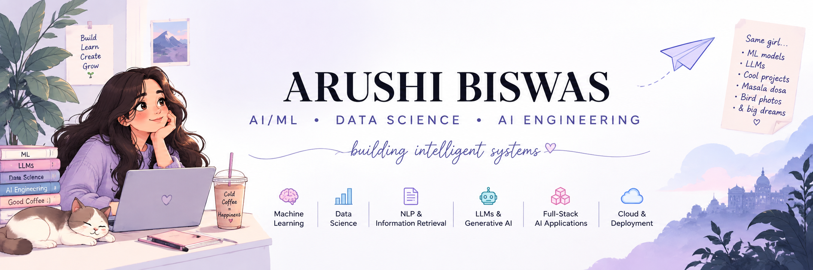

<p align="center">
  
</p>
---

## 🧠 About Me

I'm an AI/ML enthusiast interested in building practical systems at the intersection of **machine learning, software engineering and AI**.

I'm particularly interested in:

* 🤖 Machine Learning & Deep Learning
* 🧠 LLMs & Generative AI
* 🔎 RAG & Information Retrieval
* 📊 Data Science & Analytics
* 👁️ Computer Vision & NLP
* 🌐 Full-Stack AI Applications
* ☁️ Cloud & AI Deployment

---

## 🚀 Featured Projects

### 💰 [FinSight](https://github.com/Arushi2505/FinSight)

**AI-powered Personal Finance Intelligence Platform**

Analyze financial transactions, automatically categorize spending, detect anomalies and generate explainable financial insights.

**Tech:** `Python` `FastAPI` `React` `Machine Learning`

---

### 📄 [AI Resume Analyzer](https://github.com/Arushi2505/AI-Resume-Analyzer)

**AI-powered Resume & Job Matching System**

Analyzes resumes against job descriptions using NLP and semantic similarity to identify matching skills and skill gaps.

**Tech:** `Python` `FastAPI` `React` `NLP` `Semantic Similarity`

---

### 🚦 [Urban Mobility Management](https://github.com/Arushi2505/Urban-Mobility-Management)

**AI-based Traffic & Route Optimization**

Combines traffic-density detection, regression models and A* pathfinding to support intelligent urban mobility.

**Tech:** `Python` `YOLO` `Machine Learning` `A*`

---

### 🌱 [GreenMind](https://github.com/Arushi2505/GreenMind)

**Intelligent Crop Recommendation & Greenhouse Management**

Machine-learning based system designed to support smarter agricultural decisions.

**Tech:** `Python` `Machine Learning` `Data Science`

---

## 🛠️ Tech Stack

**Languages**

`Python` `SQL` `JavaScript` `Java`

**AI / ML**

`Machine Learning` `Deep Learning` `NLP` `Computer Vision`

`Scikit-learn` `PyTorch` `TensorFlow`

**AI Engineering**

`LLMs` `RAG` `LangChain` `LlamaIndex`

**Development**

`React` `FastAPI` `Node.js` `Git` `GitHub`

**Cloud & DevOps**

`Docker` `Kubernetes` `Azure`

---

## 🌱 Currently Exploring

```text
LLM Applications
      ↓
Retrieval-Augmented Generation
      ↓
AI Agents
      ↓
Production AI Systems
```

I'm currently focused on understanding how AI systems move beyond notebooks and become **reliable, usable products**.

---

## 📌 What I'm Looking For

I'm interested in opportunities involving:

**AI/ML Engineering · Data Science · AI Engineering · LLMs · RAG**

---

## 🤝 Let's Connect

If you're building something interesting in AI, ML or developer tools, I'd love to connect.

⭐ Thanks for stopping by!
